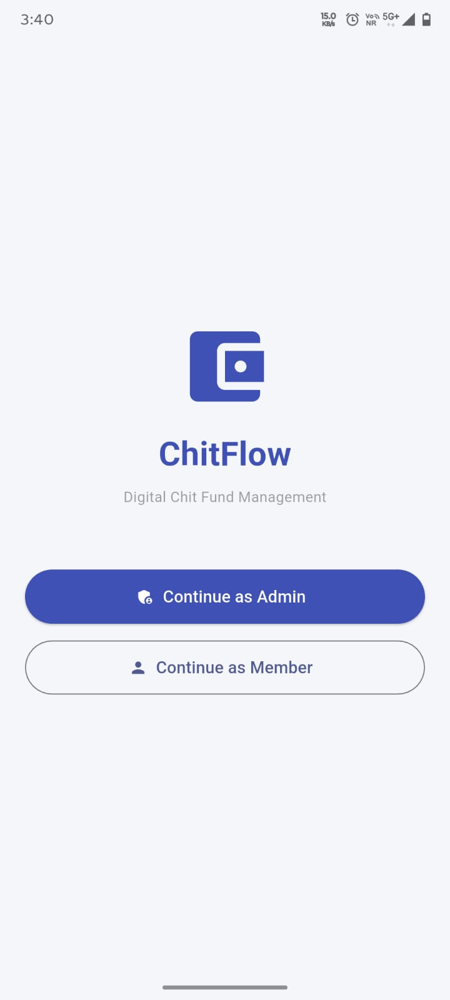
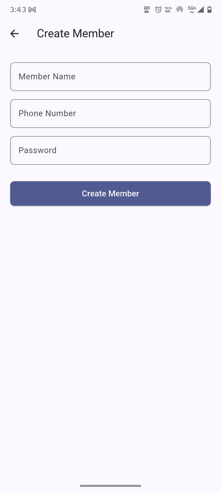
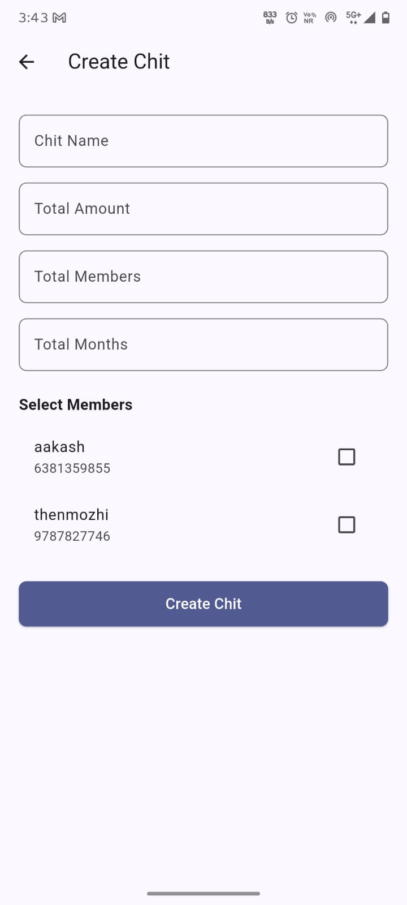
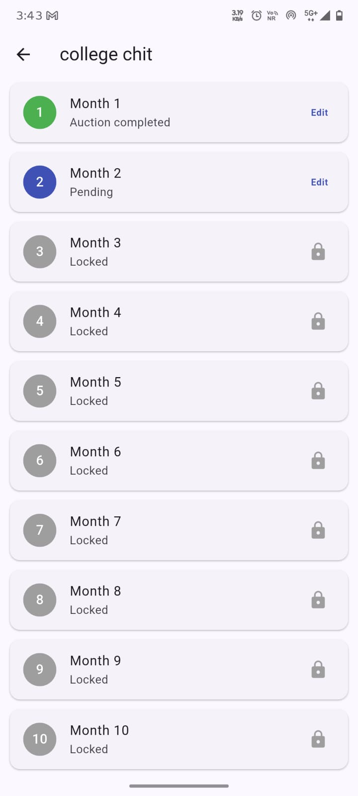
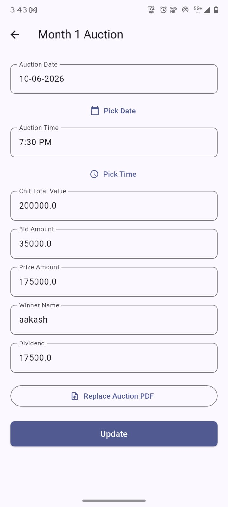
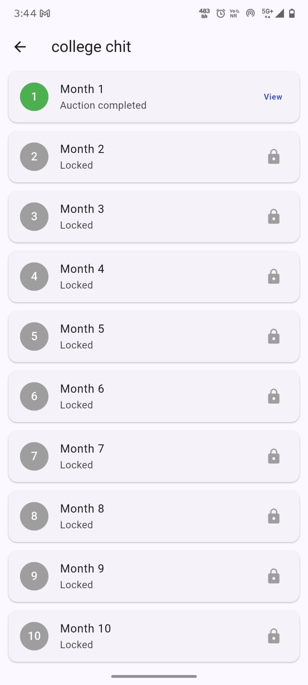

# ChitFlow — Digital Chit Fund Management System

A mobile app that replaces the WhatsApp-group-and-notebook method of running a family or
community chit fund with a simple, transparent digital system.

Built with **Flutter**, **Cloud Firestore**, **Firebase Storage**, and **Hive**.

---

## What problem does this solve?

A chit fund is a common informal group savings system: members contribute a fixed amount
every month, and each month one member "wins" the pooled amount through a bidding auction.
Traditionally this is tracked on paper or in a WhatsApp group — records get lost, members
can't verify old auctions, and there's no single source of truth.

**ChitFlow gives it a proper system of record:** one Admin manages the fund and every
member can see exactly what happened, every month, with a document to prove it.

---

## Two roles, two experiences

| | Admin | Member |
|---|---|---|
| Creates members & chits | ✅ | ❌ |
| Records monthly auction results | ✅ | View only |
| Uploads auction proof (PDF) | ✅ | Downloads only |
| Sees | All chits | Only chits they belong to |

---

## App Walkthrough

<h2>📱 Application Screenshots</h2>

<p align="center">
  
  
  
</p>

<p align="center">
  
  
  
</p>

<p align="center">
  
  
  
</p>

---

## Tech Stack & Why

| Layer | Choice | Why |
|---|---|---|
| App framework | Flutter | Single codebase for Android & iOS |
| State management | Provider | Lightweight, clear separation between UI and business logic |
| Cloud database | Cloud Firestore | No backend server to build/host; real-time capable |
| File storage | Firebase Storage | Purpose-built for binary files (PDFs), separate from the database |
| Local cache | Hive | Fast, offline member list on the Admin's device — avoids a database read every time a chit is created |

---

## Architecture

```
lib/
├── models/       → Typed data classes (AppUser, ChitModel, MonthModel)
├── services/     → All direct Firestore / Storage / Hive calls live here
├── providers/    → Business logic + app state (Provider/ChangeNotifier)
├── screens/      → UI screens, split by role (admin/ vs member/)
├── widgets/      → Reusable UI components
└── utils/        → Constants & form validation
```

The app follows a simple layered structure: **UI → State (Providers) → Data access
(Services) → Firebase/Hive**. This keeps the screens focused purely on layout, while all
business rules and data fetching live in one testable, swappable layer.

---

## Key Design Decisions

- **Sequential month unlocking** — an Admin can't skip ahead and edit Month 5 before
  Month 4 is filled in, mirroring how a real chit fund actually progresses.
- **Members stored as a map inside each chit document** (instead of a separate join
  table) — Firestore has no joins, so this trades a little duplication for fast reads.
- **Phone number as the user's document ID** — enables a direct O(1) lookup at login
  instead of running a search query.
- **Hive cache on the Admin's device only** — Members are cached locally so selecting
  them while creating a chit is instant and doesn't re-query Firestore every time.

---

## Setup / Run Locally

See [`SETUP.md`](SETUP.md) for full step-by-step instructions, including Firebase
project setup.

Quick version:
```bash
flutter pub get
flutterfire configure
flutter run
```

---

## Known Limitations (by design, for project scope)

- Passwords are stored as plain text for simplicity — a production version would use
  Firebase Authentication with proper hashing instead of a client-side string comparison.
- Firestore/Storage security rules are left open for easy local testing — these would be
  locked down to authenticated, role-based access before any real deployment.
